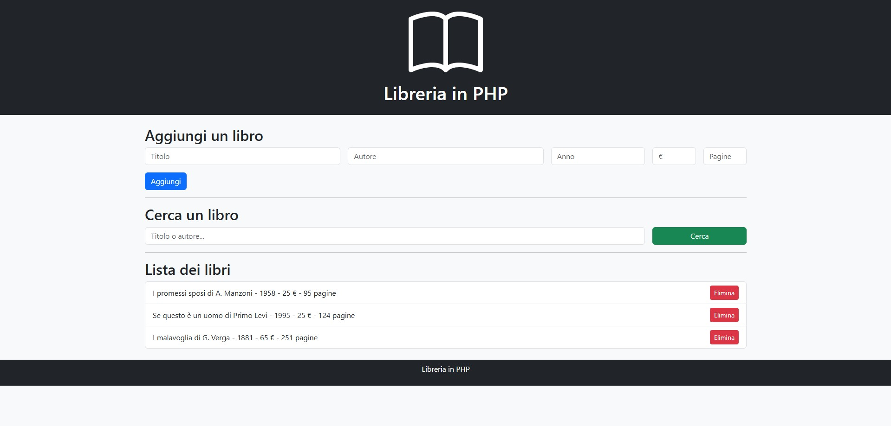

# Libreria in PHP
## aggiungere, visualizzare, cercare, eliminare libri
*Novembre 2025*


---




🔨
| Nome | Linguaggio | Versione |
|------|------------|----------|      
| PHP  | Backend    | 8.3      |
| XAMPP| Server     |          | 


```bash
Avviare XAMPP
Start APACHE SERVER
http://localhost/index.php
